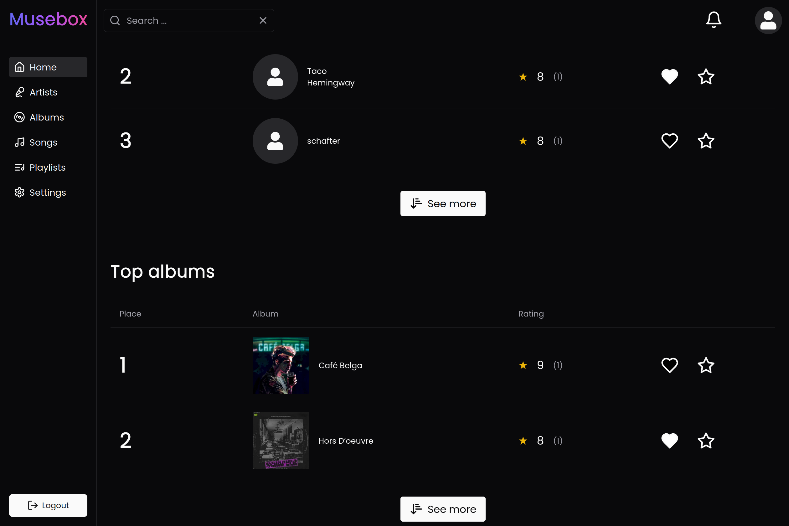

# 🎵 MuseBox

MuseBox is a web application where users can discover and rate their favorite artists, albums, and songs. Each user has a profile showcasing their music preferences, including favorite artist, album, and song. Users can follow others to stay updated on their activity, such as new ratings. The app also features rankings for top artists, albums, and songs.

👉 [Log in as a guest](https://muse-box.vercel.app/auth/login?guest=true) to explore the platform!

## ✨ Features

- ⭐ Rate and review artists, albums, and songs.
- 👥 Follow users and track their activity.
- 📈 View rankings of top-rated music.
- 🎧 Personalized profiles showcasing music preferences.

## 🛠️ Tech Stack

- **Frontend**: Next.js, React, TypeScript, TailwindCSS, Shadcn
- **Backend**: Drizzle, Turso (SQLite database)
- **Authentication**: NextAuth
- **Deployment**: Vercel
- **Next.js Features**: Streaming, Incremental Static Regeneration (ISR), and Optimistic UI updates for a smoother user experience.

## 🏛️ Clean Architecture

MuseBox follows Clean Architecture principles to maintain separation of concerns across different layers of the application. This architecture was implemented as part of a learning exercise to explore Clean Architecture concepts.

- **src** - The root of the system.
  - **application** - Application Layer: Holds use cases and interfaces for repositories and services.
  - **entities** - Entities Layer: Contains models and custom errors.
  - **infrastructure** - Infrastructure Layer: Implements repositories and services.
  - **interface-adapters** - Interface Adapters Layer: Contains controllers that interact with external systems.

## 🚀 Installation

1. Clone the repository:
   ```bash
   git clone https://github.com/Ressobe/muse-box
   ```
2. Install dependencies:
   ```bash
   bun install
   ```
3. Configure environment variables by copying `.env.sample` to `.env` and updating the values.
4. Start the development server:
   ```bash
   bun run dev
   ```
5. Visit `http://localhost:3000` to view the app.

## 📋 Environment Variables

Make sure to set up the following environment variables in your `.env` file:

```bash
NEXT_PUBLIC_APP_URL=<Your application URL>
AUTH_SECRET=<Secret for authentication>
RESEND_API_KEY=<Resend API key for emails>
GOOGLE_CLIENT_ID=<Google OAuth client ID>
GOOGLE_CLIENT_SECRET=<Google OAuth client secret>
GITHUB_CLIENT_ID=<GitHub OAuth client ID>
GITHUB_CLIENT_SECRET=<GitHub OAuth client secret>
AUTH_DRIZZLE_URL=<Drizzle Auth URL>
TURSO_DATABASE_URL=<Turso database URL>
TURSO_AUTH_TOKEN=<Turso Auth Token>
```

These environment variables are essential for running the project and setting up OAuth integrations and database connections.

## 📸 Screenshots




## 🌍 Deployment

The app is deployed on Vercel. Check out [Vercel documentation](https://vercel.com/docs) for details.

## 🤝 Contributing

Contributions are welcome! Feel free to open issues or submit pull requests.

## 📝 License

This project is licensed under the MIT License. See the [LICENSE](./LICENSE) file for more details.
